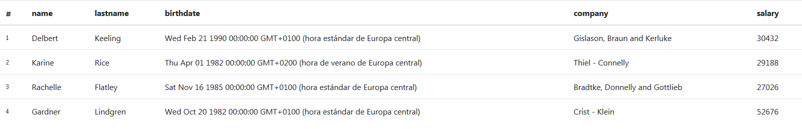

# NgxTable

NgxTable is an angular component that shows your data in a table and allows you to control the most common events.

## Install

[WIP]

## Dependencies

- [Bootstrap 4](https://getbootstrap.com/): `npm install bootstrap --save`
- [FontAwesome](https://fontawesome.com/): `npm install @fortawesome/fontawesome-free --save`

## Features

- **Show data**: this component shows an array of objects in a table.
- **Custom headers**: you can specify custom headers names.
- **Order event**: this component fires an order event everytime user click on a table header.
- **Filter event**: this component shows a filter row. Everytime you write in those headers an event is fired with filter informacion.
- **Create event**: this component shows a create row. Users can fill it an then press "Create". An event will be fired with creation info. [WIP]
- **Delete event**: this component shows a delete column per each row. when user click on it, an event will be fired with the delete info. [WIP]
- **Edit event**: each cell can be clicked to edit them. After edition, an edit button can be clicked and an event will be fired with the edition info. [WIP] 
- **Pagination**: you can specify the elements per page and a paginator component will be shown at the bottom of the table. When each button in the paginator is clicked, an event with the pagination info will be fired. [WIP]

## Usage

In the basic usage you just have to pass your data as a component input

```typescript
const exampleData: any[] = [
    { name: 'Delbert', lastname: 'Keeling', birthdate: new Date(1990, 1, 21), company: 'Gislason, Braun and Kerluke', salary: 30432 },
    { name: 'Karine', lastname: 'Rice', birthdate: new Date(1982, 3, 1), company: 'Thiel - Connelly', salary: 29188 },
    { name: 'Rachelle', lastname: 'Flatley', birthdate: new Date(1985, 10, 16), company: 'Bradtke, Donnelly and Gottlieb', salary: 27026 },
    { name: 'Gardner', lastname: 'Lindgren', birthdate: new Date(1982, 9, 20), company: 'Crist - Klein', salary: 52676 }
];
```
```html
<ngx-table [data]="exampleData"></ngx-table>
```



## Order

When order feature is enable, you can click a header to fire the order event.

### Enable order in config object

```typescript
config: NgxTableConfig = {
    ...
    order: {
        enable: false
    }
    ...
};
```

### Bind order event

```html
<!-- in your html -->
<ngx-table [data]="exampleData" [config]="config" (order)="onOrder($event)"></ngx-table>
```

```typescript
// in your component .ts
onOrder(order: NgxTableOrder) {
    // update your data object with your order logic
}
```

### NgxTableOrder type

```typescript
export type NgxTableOrder = {
    field: string,
    direction: 1 | -1
};
```
- **field**: column name to order
- **direction**:
    - 1: ascending
    - -1: descending

## Filter

When filter feature is enable, you can fill the filter row to fire the fiter event.

### Enable filter in config object

```typescript
config: NgxTableConfig = {
    ...
    filter: {
        enable: false,
        ...
    }
    ...
};
```

### Bind filter event

```html
<!-- in your html -->
<ngx-table [data]="exampleData" [config]="config" (filter)="onFilter($event)"></ngx-table>
```

```typescript
// in your component .ts
onOrder(filter: NgxTableFilter) {
    // update your data object with your filter logic
}
```

### NgxTableFilter type

```typescript
export type NgxTableFilter { 
    [key: string]: {
        operator: string,
        value: string
    }
};
```
- **key**: field name to filter
- **operator**: the operator user has select
- **value**: the value of the filter

## Config


This component manage a configuration object with the following structure (WIP):

```typescript
export type NgxTableConfig = {
    placeholders?: NgxTablePlaceholders,
    order?: {
        enable?: boolean
    },
    filter?: {
        enable?: boolean,
        debounceTime?: number,
        validations?: {
            [key: string]: {
                regex: string,
                errorMsg: string
            }
        }
    }
};
```

Default config

```typescript
config: NgxTableConfig = {
    placeholders: [],
    order: {
        enable: false
    },
    filter: {
        enable: false,
        debounceTime: 500,
        validations: { }
    }
};
```